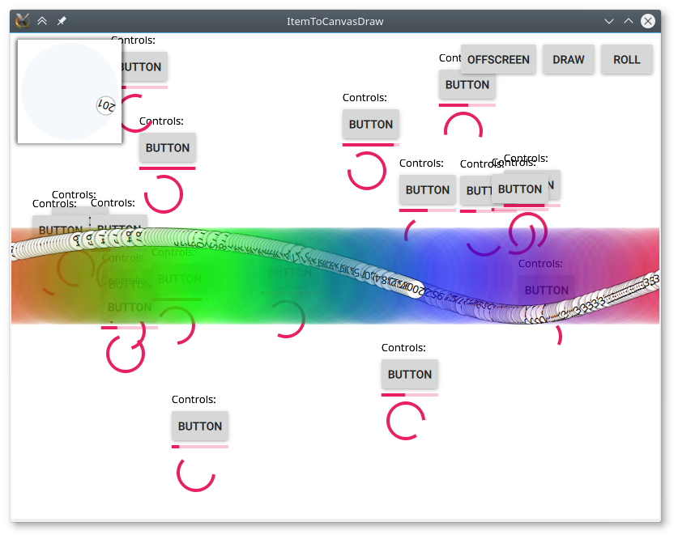

# [ItemToCanvasDraw](./main.qml)
This project demostrates how to paint the content of Item into a canvas with **QQuickItemGrabResult**.

##[sprite_generator](./sprite_generator.qml)
Record QML animation to canvas and then saves the sprite to file.

##[scroll_and_stitch](./scroll_and_stitch.qml)
So easy to stitch and save the webpage.

