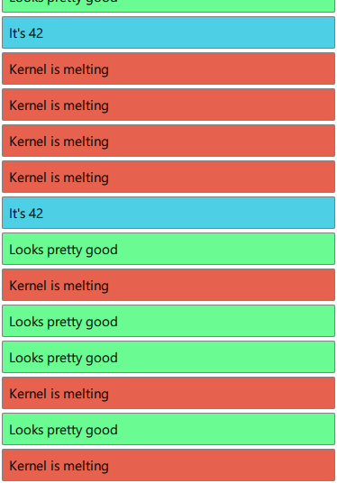

[SimpleConsole](./main.qml)
===========================

Redirect JS console to UI is really cool.

If you don't want a piece of C++ code to redirect console output, why not replace it with an Item, when available, falling back it to original console:

```javascript
  var konsole = console

  Component.onCompleted: {
  	Js.konsole = konsole
  }
```



By implementing stringfy and using arguments, you can make it better compatible to the console API.
